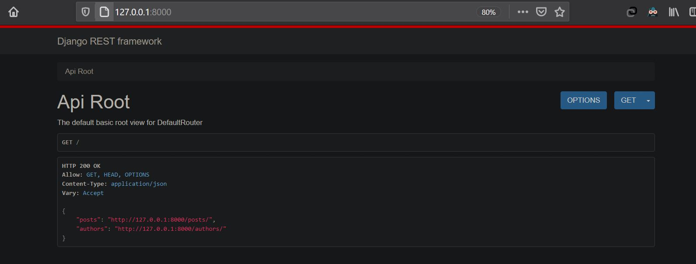
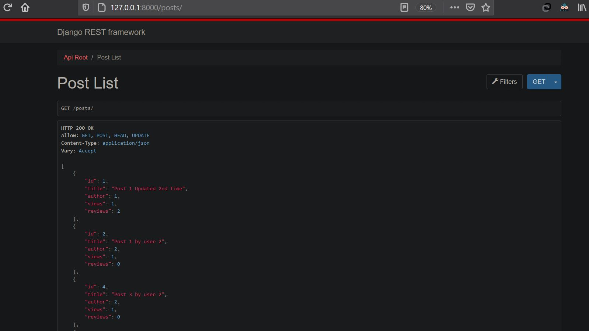
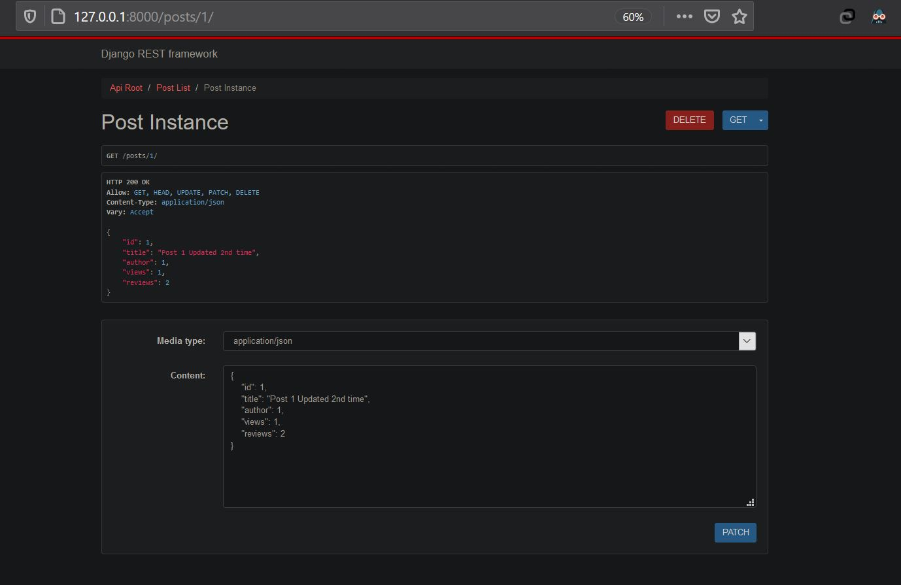
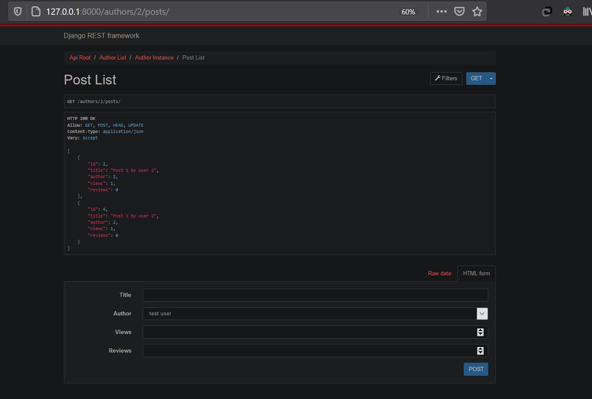
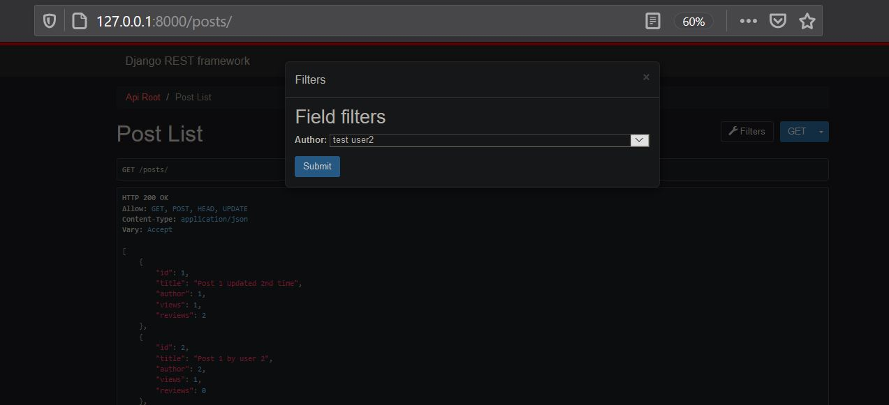

# REST API - CIQ

## Running the Project Locally
```
	pip install -r requirements.txt
	python manage.py migrate
	python manage.py runserver

```
The project will be available at **127.0.0.1:8000**.

**Note** : Secret Key is pushed intentionally and DEBUG mode is True as it was a task, also it is advised to use virtual environment for running the project and virtualenv should be intialized in folder level one above the folder containing manage.py file

## Structure
RESTful API, endpoints (URLs), API has GET, POST, PUT, PATCH, DELETE features present at the mentioned endpoints. It also has filtering features.

Endpoint |HTTP Method | CRUD Method | Result
-- | -- |-- |--
`/posts/` | GET | READ | Get all posts
`/posts/:id` | GET | READ | Get a single post
`/posts/`| POST | CREATE | Create a new post
`/posts/:id` | PATCH | UPDATE | Update a post
`/posts/:id` | DELETE | DELETE | Delete a post
`/authors/` | GET | READ | Get all authors
`/authors/:id`| GET | READ | Get a single author
`/authors/:id`| PUT | UPDATE | Update an author
`/authors/:id/posts` | GET | READ | Nested Query Get all posts by particular author


## Screenshot

## API Root

<br />

## GET

<br />

## Post PATCH

<br />

## Authors/id/posts - Nested


## Filter
